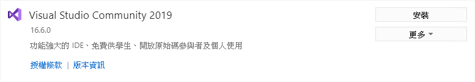
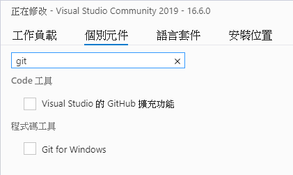
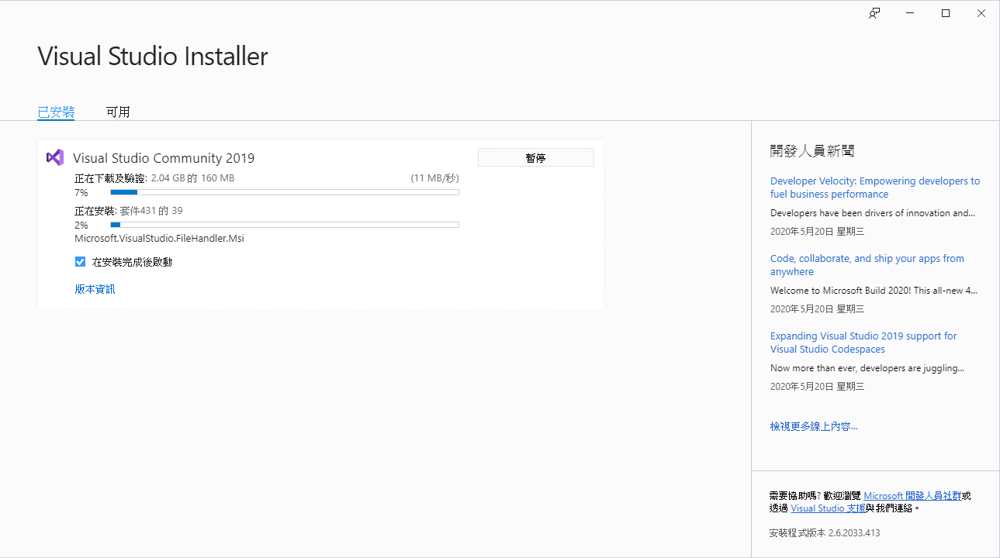
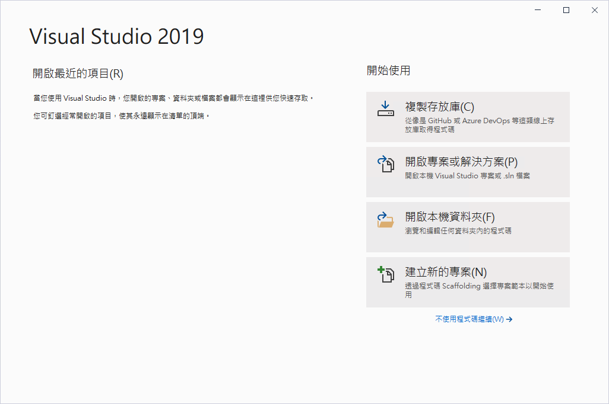
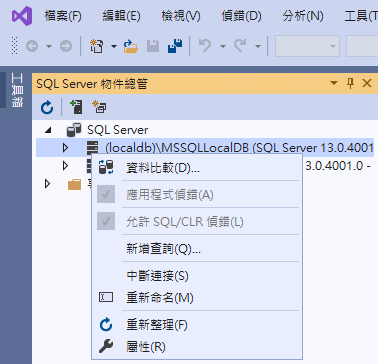
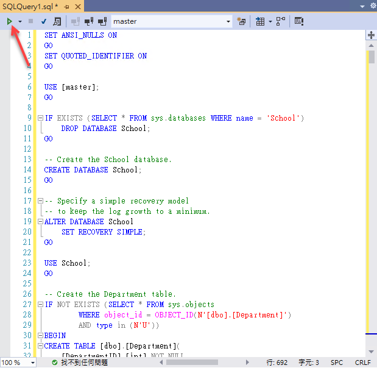
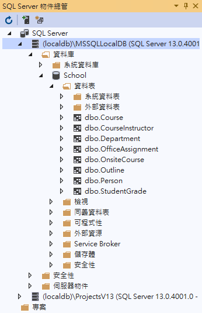

# 事前準備工作

若想要進行這兩種類型專案開發練習 ( [使用 Syncfusion 元件來完成 Contoso University 的資料庫存取應用](https://github.com/vulcanlee/Blazor-HOL/tree/master/SyncfusionLab) 、 [使用 MatBlazor 元件來完成 Contoso University 的資料庫存取應用](https://github.com/vulcanlee/Blazor-HOL/tree/master/MatBlazorLab))，請先在開發電腦上，準備這裡說明的相關軟體與操作步驟。

## 安裝 Visual Studio 2019

在這裡將會進行安裝 [Visual Studio Community 2019](https://visualstudio.microsoft.com/zh-hant/downloads/) 版本，這個時間點，將會進行 Visual Studio 2019 的 16.6.0 版本的安裝

* 下載與啟動完成 Visual Studio Installer 程式之後，將會看到 [工作負載] 標籤頁次
* 請在 [工作負載] 標籤頁次內找到並且勾選 [.NET Core 平台開發] 選項

* 切換到 [個別元件] 標籤頁次下
* 在文字輸入盒中，輸入 `git` 文字，進行搜尋
* 請勾選搜尋到的 [Visual Studio 的 GitHub 擴充功能] & [Git for Windows] 兩個選項

* 最後，點選右下角的 [安裝] 按鈕
* 開始進行 Visual Studio 2019 的安裝

* 當安裝完成，第一次啟動 Visual Studio 的時候，請在 [從孰悉的環境開始] > [開發設定] 欄位，選擇 [Visual C#]
* 完成後，點選 [啟動 Visual Studio] 按鈕

## 安裝 SQL Server Management Studio (SSMS)

請點選 [SQL Server Management Studio (SSMS)](https://docs.microsoft.com/zh-tw/sql/ssms/download-sql-server-management-studio-ssms?view=sql-server-ver15) 連結，下載並且安裝 SQL Server Management Studio (SSMS) 到開發電腦上。

## 練習使用資料庫的建立方式

* 請先開啟 Visual Studio 2019
* 當 [Visual Studio 2019] 對話窗出現之後，請點選右下方的 [不使用程式碼繼續] 連結

* 點選功能表 [檢視] > [SQL Server 物件總管]
* 滑鼠右擊 [SQL Server] > [(localdb)\MSSQLLocalDB...] 節點
* 選擇 [新增查詢] 選項

* 取得 [SchemaAndData.sql](https://raw.githubusercontent.com/vulcanlee/Blazor-HOL/master/Database/SchemaAndData.sql) 檔案內容，複製到剪貼簿內
* 到剛剛產生的查詢視窗 (SQLQuery1.sql) 內，貼上剪貼簿的內容
* 在 [SQLQuery1.sql] 視窗的左上方，點選綠色三角形，執行該 SQL 指令，以便建立資料庫、相關資料表與索引、測試資料

* 回到 [SQL Server 物件總管] 視窗內，查看 School 資料庫是否已經成功建立起來

