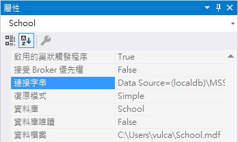
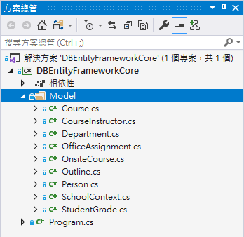
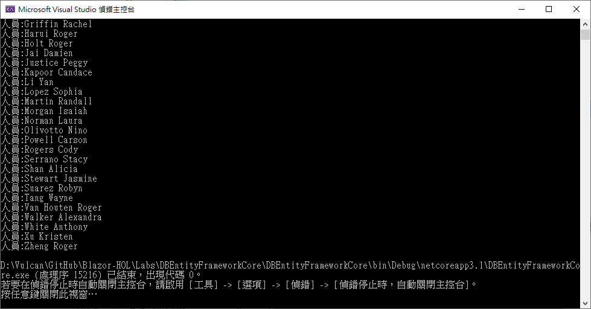

# 使用 Entity Framework Core 來存取資料庫

在這篇文章中，將會透過 Visual Studio 建立一個 Console 應用程式，使用 Entity Framework Core 來讀取這個已經存在的資料庫內的資料表紀錄內容。

## 建立 .NET Core 之 Console 專案

* 打開 Visual Studio 2019
* 點選右下方的 [建立新的專案] 按鈕
* [建立新專案] 對話窗將會顯示在螢幕上
* 從[建立新專案] 對話窗的中間區域，找到 [主控台應用程式] 這個專案樣板選項，並且選擇這個項目
* 點選右下角的 [下一步] 按鈕
* 現在 [設定新的專案] 對話窗將會出現
* 請在這個對話窗內，輸入適當的 [專案名稱] 、 [位置] 、 [解決方案名稱]

  在這裡請輸入 [專案名稱] 為 `DBEntityFrameworkCore`

* 完成後，請點選 [建立] 按鈕
* 稍微等會一段時間，專案將會建立起來

## 安裝需要用到的套件

* 滑鼠右擊專案 [相依性] > [管理 NuGet 套件]
* 搜尋 [Microsoft.EntityFrameworkCore.SqlServer] 套件，安裝到專案內
* 搜尋 [Microsoft.EntityFrameworkCore.Design] 套件，安裝到專案內
* 搜尋 [Microsoft.EntityFrameworkCore.Tools] 套件，安裝到專案內

  > 關於 Entity Framework Core 可以使用的指令，可以參考 [Entity Framework Core 工具參考-Visual Studio 中的套件管理員主控台](https://docs.microsoft.com/zh-tw/ef/core/miscellaneous/cli/powershell) 或者 [Entity Framework Core 工具參考-.NET CLI](https://docs.microsoft.com/zh-tw/ef/core/miscellaneous/cli/dotnet)

## 建立資料庫模型

* 點選功能表 [工具] > [NuGet 套件管理員] > [套件管理器主控台]
* 在 [套件管理器主控台] 內輸入底下指令

```
Scaffold-DbContext "Data Source=(localdb)\MSSQLLocalDB;Initial Catalog=School;Integrated Security=True;Connect Timeout=30;Encrypt=False;TrustServerCertificate=False;ApplicationIntent=ReadWrite;MultiSubnetFailover=False" Microsoft.EntityFrameworkCore.SqlServer -OutputDir Models -f
```

> 其中關於上述指定中雙引號內的內容，請打開 [SQL Server 物件總管] ，點選到 資料庫伺服器的節點，接著，查看 [屬性] 視窗內的 [連接字串]，將其屬性值複製起來，貼上到雙引號內
>
>  

* 完成後，按下 [Enter] 按鍵，執行這個命令

* 此時便可以在 Visual Studio 檔案總館內，看到有 Models 資料夾產生，而在該資料夾內也產生了許多檔案出來

  

## 開始使用 Entity Framework Core 來讀取資料庫

* 打開 Program.cs 檔案，輸入底下程式碼

```csharp
using DBEntityFrameworkCore.Model;
using Microsoft.EntityFrameworkCore;
using System;
using System.Linq;
using System.Threading.Tasks;

namespace DBEntityFrameworkCore
{
    class Program
    {
        static async Task Main(string[] args)
        {
            SchoolContext context = new SchoolContext();
            var people = await context.Person
                .OrderBy(x=>x.LastName)
                .ThenBy(x=>x.FirstName)
                .ToListAsync();
            foreach (var item in people)
            {
                Console.WriteLine($"人員:{item.LastName} {item.FirstName}");
            }
        }
    }
}
```

* 執行這個專案，將會看到底下的輸出內容，若有看到，就代表已經成功讀取資料庫紀錄了。



```
人員:Abercrombie Kim
人員:Alexander Carson
人員:Alonso Meredith
人員:Anand Arturo
人員:Barzdukas Gytis
人員:Browning Meredith
人員:Bryant Carson
人員:Carlson Robyn
人員:Fakhouri Fadi
人員:Gao Erica
人員:Griffin Rachel
人員:Harui Roger
人員:Holt Roger
人員:Jai Damien
人員:Justice Peggy
人員:Kapoor Candace
人員:Li Yan
人員:Lopez Sophia
人員:Martin Randall
人員:Morgan Isaiah
人員:Norman Laura
人員:Olivotto Nino
人員:Powell Carson
人員:Rogers Cody
人員:Serrano Stacy
人員:Shan Alicia
人員:Stewart Jasmine
人員:Suarez Robyn
人員:Tang Wayne
人員:Van Houten Roger
人員:Walker Alexandra
人員:White Anthony
人員:Xu Kristen
人員:Zheng Roger
```