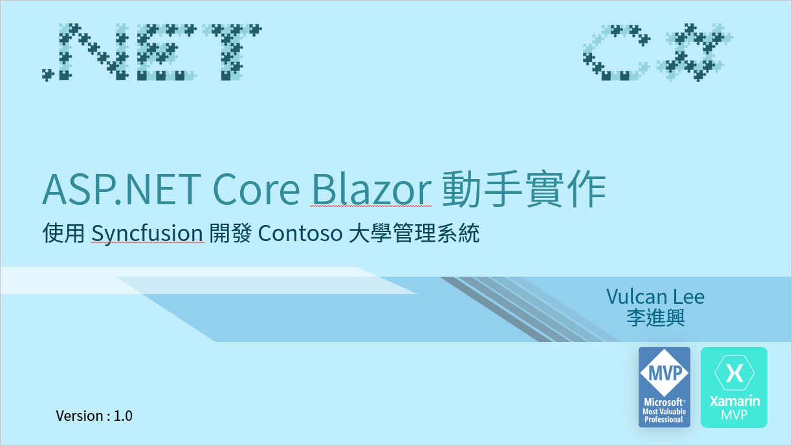

# Blazor Hands-On 教育訓練專案原始碼



這是一份專門針對 ASP.NET Core Blazor Server Side 類型專案所設計的教育訓練開發實作課程。在這份課程中，將會帶領學員從無到有的開發出 Contoso 大學的管理系統，並且將會使用免費的 [MatBlazor](https://www.matblazor.com/) UI 元件與 [Syncfusion](https://www.syncfusion.com/blazor-components) UI 原件來進行設計，在這個系統終將會包含了底下類型的應用：

* 單一資料表的 CRUD 新增、修改、刪除、查詢、搜尋、排序、分頁之設計方式
* 多對一的 CRUD 練習
* 多對多的 CRUD 練習
* 可以開啟視窗，選擇其他資料表內的紀錄

## 說明文件

* [事前準備工作](Docs/chapter01.md)
* [使用 Entity Framework Core 來存取資料庫](Docs/chapter02.md)

# 專案資料夾

|類型|專案名稱|專案說明|
|-|-|-|
|最終成品|SyncfusionLab|使用 Syncfusion 元件來完成 Contoso University 的資料庫存取應用|
|最終成品|MatBlazorLab|使用 MatBlazor 元件來完成 Contoso University 的資料庫存取應用|
|練習情境|Labs/DBEntityFrameworkCore|使用 Entity Framework Core 來存取資料庫|
|挑戰練習|DBEntityFrameworkCoreCRUD/Starter|用 Console 專案對 person 資料表做 CRUD 存取|
|練習情境|bzEntityFrameworkCore|使用 Blaozr 專案來顯示出 person 所有紀錄|
|挑戰練習|bzEntityFrameworkCoreBS4\Starter|使用 table 標籤與 BS4 來格式化 person 所有紀錄|
||||
||||
||||
||||

# 單一資料表的 CRUD 開發步驟說明

* StudentGrade
* StudentGradeService
* StudentGradeAdaptorModel
* StudentGradeAdaptor
* StudentGradeRazorModel
* StudentGradeView
* StudentGradePage

* 建立 StudentGrade 的服務
* 建立 StudentGrade 轉接器 資料模型 Adaptor Data Model
* 建立 StudentGrade 服務與 Grid 元件要用到的 轉接器元件 Adaptor Component
* 建立 StudentGrade 頁面要用到的 Razor 資料模型 Razor Data Model
* 建立 StudentGrade CRUD 的 View 元件
* 建立 StudentGrade CRUD 的 Page 頁面

Scaffold-DbContext "Data Source=(localdb)\MSSQLLocalDB;Initial Catalog=School;Integrated Security=True;Connect Timeout=60;Encrypt=False;TrustServerCertificate=False;ApplicationIntent=ReadWrite;MultiSubnetFailover=False" Microsoft.EntityFrameworkCore.SqlServer -StartupProject DatabaseInit -Project EFCoreModel -OutputDir Models -f
```

