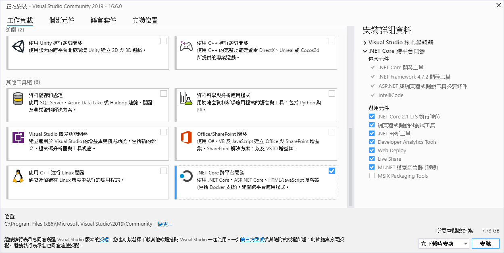
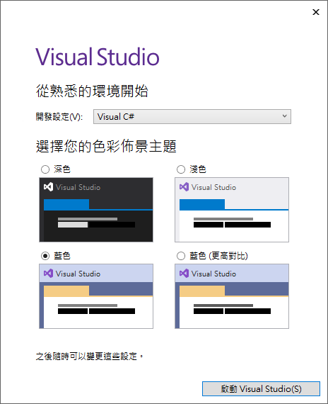

# Blazor Hands-On 教育訓練專案原始碼

這是一份專門針對 ASP.NET Core Blazor Server Side 類型專案所設計的教育訓練開發實作課程。在這份課程中，將會帶領學員從無到有的開發出 Contoso 大學的管理系統，並且將會使用免費的 [MatBlazor](https://www.matblazor.com/) UI 元件與 [Syncfusion](https://www.syncfusion.com/blazor-components) UI 原件來進行設計，在這個系統終將會包含了底下類型的應用：

* 單一資料表的 CRUD 新增、修改、刪除、查詢、搜尋、排序、分頁之設計方式
* 多對一的 CRUD 練習
* 多對多的 CRUD 練習
* 可以開啟視窗，選擇其他資料表內的紀錄

# 事前準備工作

若想要進行這兩種類型專案開發練習 ( [使用 Syncfusion 元件來完成 Contoso University 的資料庫存取應用](SyncfusionLab) 、 [使用 MatBlazor 元件來完成 Contoso University 的資料庫存取應用](MatBlazorLab))，請先在開發電腦上，準備這裡說明的相關軟體與操作步驟。

## 安裝 Visual Studio 2019

在這裡將會進行安裝 [Visual Studio Community 2019](https://visualstudio.microsoft.com/zh-hant/downloads/) 版本，這個時間點，將會進行 Visual Studio 2019 的 16.6.0 版本的安裝


* 下載與啟動完成 Visual Studio Installer 程式之後，將會看到 [工作負載] 標籤頁次
* 請在 [工作負載] 標籤頁次內找到並且勾選 [.NET Core 平台開發] 選項
* 最後，點選右下角的 [安裝] 按鈕
* 開始進行 Visual Studio 2019 的安裝




* 當安裝完成，第一次啟動 Visual Studio 的時候，請在 [從孰悉的環境開始] > [開發設定] 欄位，選擇 [Visual C#]
* 完成後，點選 [啟動 Visual Studio] 按鈕



## 練習使用資料庫的建立方式

* 請先開啟 Visual Studio 2019
* 當 [Visual Studio 2019] 對話窗出現之後，請點選右下方的 [不使用程式碼繼續] 連結


* 點選功能表 [檢視] > [SQL Server 物件總管]
* 滑鼠右擊 [SQL Server] > [(localdb)\MSSQLLocalDB...] 節點
* 選擇 [新增查詢] 選項


* 取得 [SchemaAndData.sql](https://raw.githubusercontent.com/vulcanlee/Blazor-HOL/master/Database/SchemaAndData.sql) 檔案內容，複製到剪貼簿內
* 到剛剛產生的查詢視窗 (SQLQuery1.sql) 內，貼上剪貼簿的內容
* 在 [SQLQuery1.sql] 視窗的左上方，點選綠色三角形，執行該 SQL 指令，以便建立資料庫、相關資料表與索引、測試資料


* 回到 [SQL Server 物件總管] 視窗內，查看 School 資料庫是否已經成功建立起來


# 專案資料夾

|類型|專案名稱|專案說明|
|-|-|-|
||SyncfusionLab|使用 Syncfusion 元件來完成 Contoso University 的資料庫存取應用|
||MatBlazorLab|使用 MatBlazor 元件來完成 Contoso University 的資料庫存取應用|
||||
||||
||||
||||
||||
||||
||||
||||
||||
||||
||||

# 單一資料表的 CRUD 開發步驟說明

* StudentGrade
* StudentGradeService
* StudentGradeAdaptorModel
* StudentGradeAdaptor
* StudentGradeRazorModel
* StudentGradeView
* StudentGradePage

* 建立 StudentGrade 的服務
* 建立 StudentGrade 轉接器 資料模型 Adaptor Data Model
* 建立 StudentGrade 服務與 Grid 元件要用到的 轉接器元件 Adaptor Component
* 建立 StudentGrade 頁面要用到的 Razor 資料模型 Razor Data Model
* 建立 StudentGrade CRUD 的 View 元件
* 建立 StudentGrade CRUD 的 Page 頁面

## 產生 Entity Framework Core 的 dbContext 與 相關 Model

```
Scaffold-DbContext "Data Source=(localdb)\MSSQLLocalDB;Initial Catalog=School;Integrated Security=True;Connect Timeout=60;Encrypt=False;TrustServerCertificate=False;ApplicationIntent=ReadWrite;MultiSubnetFailover=False" Microsoft.EntityFrameworkCore.SqlServer -StartupProject DatabaseInit -Project EFCoreModel -OutputDir Models -f
```

